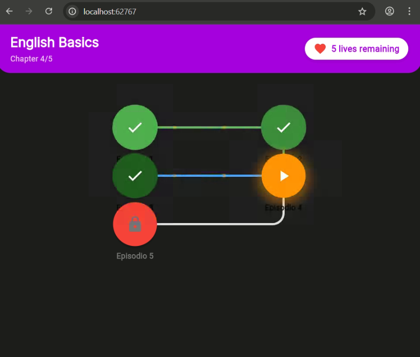

# 📚 Proyecto Final - [Nombre del Curso]

## 👩‍💻 Datos del Alumno
- **Nombre del alumno:** Camila Fernanda Cabrera Catari  
- **Fecha:** 21/10/2025  
- **Curso:** Soluciones Moviles 2
- **Docente:** Dr. Oscar Jiemenz Flores
- **Repositorio en GitHub:** https://github.com/ccabrerastu/SM2_EXAMEN_PRACTICO

---

## 🧠 Descripción del Proyecto
Este proyecto consiste en el desarrollo de una aplicación denominada Sistema de Vidas Diarias, cuyo propósito es fomentar el aprendizaje constante mediante un sistema de recompensas y limitaciones basado en vidas.

El sistema asigna 5 vidas diarias a cada estudiante, las cuales se reducen cada vez que el usuario comete un error. Si el usuario llega a 0 vidas, no puede continuar hasta el siguiente día.
Este enfoque busca motivar la práctica diaria, reforzando la constancia y la mejora continua.

La aplicación fue desarrollada con Flutter (Frontend) y NestJS + PostgreSQL (Backend), ofreciendo una experiencia fluida y adaptable a dispositivos móviles.
---

## 💡  Historia de Usuario
> **Como** usuario autenticado,
> **quiero** quiero ver un historial de mis inicios de sesión,
> **para** para saber cuándo y desde qué dispositivo accedí a mi cuenta.

Criterios de Aceptación
•	Al iniciar sesión exitosamente, se registra el usuario, la fecha y hora del inicio, así como la dirección IP desde donde inició sesión.
•	En la sección "Historial de inicios de sesión", el usuario puede ver una lista con:
o	Usuario, la Fecha y hora de inicio de sesión
•	Los registros se deben mostrar ordenados del más reciente al más antiguo.

## 💡 Historia de Usuario - Sistema de Vidas
> **Como** estudiante, 
> **quiero** tener 5 vidas diarias y perder una por cada error cometido,  
> **para** limitar mi avance y reforzar mi aprendizaje diario de forma controlada.

---

## ⚙️ Funcionalidades Implementadas
A continuación se detallan las principales características desarrolladas en la aplicación:

1. Sistema de vidas diarias – Cada día se asignan automáticamente 5 vidas por usuario.

2. Control de errores – Cada respuesta incorrecta resta una vida.

3. Bloqueo temporal – Si el usuario llega a 0 vidas, no puede continuar hasta el día siguiente.

4. Autenticación de usuarios – Permite registrarse e iniciar sesión de forma segura.

5. Sincronización con base de datos – Toda la información de progreso y vidas se guarda en PostgreSQL.

6. Interfaz amigable en Flutter – Diseñada para dispositivos móviles con retroalimentación visual al perder vidas.
---

## 📸 Evidencias del Proyecto

### 🖼️ Capturas de la Aplicación

